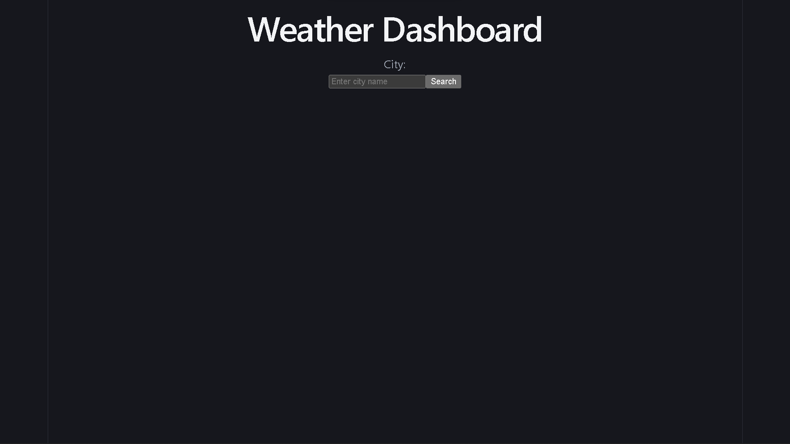
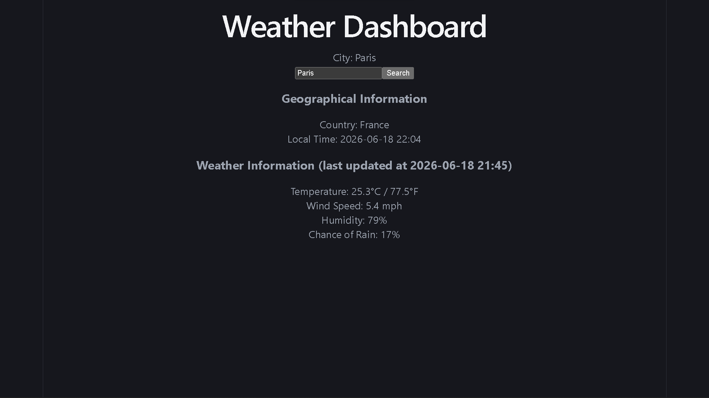

# API Weather Software

### Description
A simple weather API which takes the city name and displays current weather information including:
A modern weather app dashboard built using React and TypeScript which provides a real-time weather information for any city world-wide.

### Features
  - Search weather info by city name
  - Temprature in Celcius and Farenhiet
  - Wind Speed
  - Humidity
  - Chance of Rain

### 🛠️ Tech Stack

| Technology | Purpose |
|------------|---------|
| React 18 | UI Framework |
| TypeScript | Type Safety |
| Vite | Build Tool |
| WeatherAPI | Weather Data |
| API-Ninjas | City Coordinates |

### Live Demo
[**LIVE DEMO**]()

### APIs included

You'll need to sign up for two free APIs:

#### **API Ninjas ([LINK](https://api-ninjas.com/)):**
- API which requires the city name and your API key
- It gives you the latitude and longitude informations
- Go to [api-ninjas.com](https://api-ninjas.com/)
- Sign up for a free account
- Get your API key from the dashboard

#### **Weather API ([LINK](https://www.weatherapi.com/)):**
- API which requires the latitude, longitude and your API Keys.
- Gives location (geographical information) and current (weather information)
- Go to [weatherapi.com](https://www.weatherapi.com/)
- Sign up for a free account
- Get your API key from the dashboard

### Prerequisites

Before you begin, ensure you have the following installed:
- Node.js (v16.0.0 or higher)
- npm or yarn or pnpm

### Getting Started

#### **1. Clone the Repo**
```
git clone https://github.com/kaleablemmadev/kaleab-dev-portfolio/tree/main/02_CODING_PORTFOLIO/weather-dashboard.git

cd trinity-engine\02_CODING_PORTFOLIO\weather-dashboard
```


#### **2. Install Dependencies**
```
npm install
```
or
```
yarn install
```
or
```
pnpm install
```


#### **3. Set up Environment Variables**
```
cp .env.example .env
```


#### 4. **Run the app**
```
npm run dev
```
or
```
yarn dev
```

### Screenshots of the App

